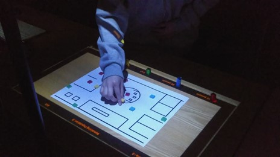
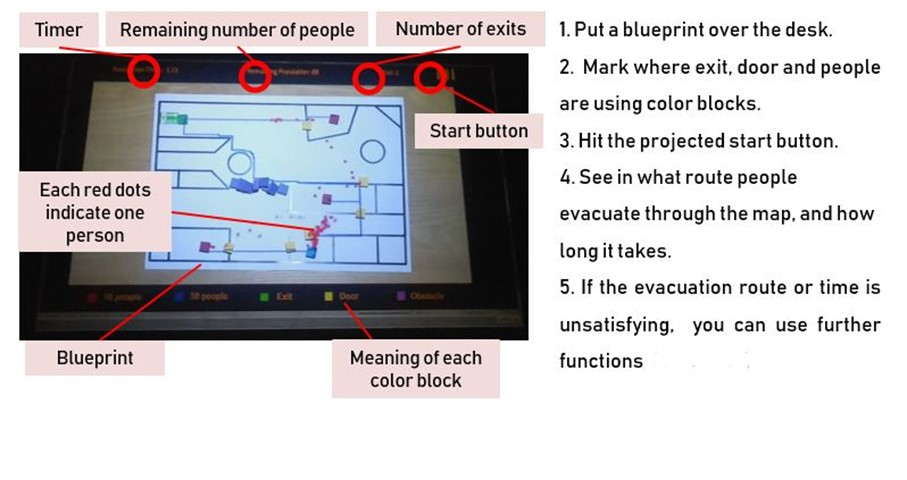
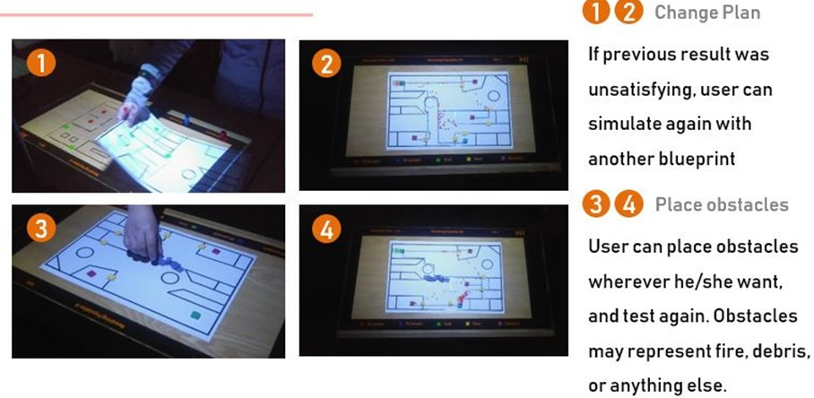
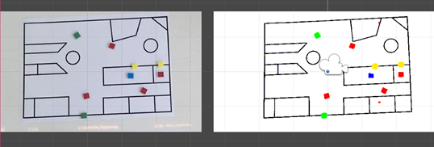
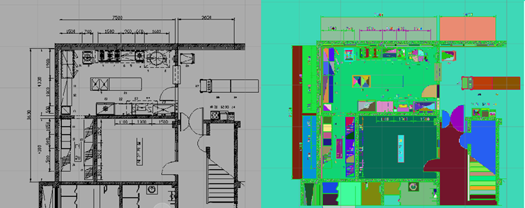
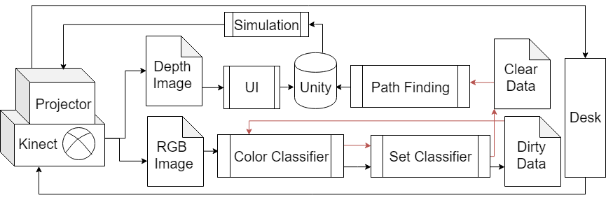

# PARES
Projection-based AR Evacuations Simulator (PARES) CS Capstone project 2019

## Teammates
한채연 Chaeyeon Han
성현모 Hyunmo Sung
김도희 Dohui Kim 

## Introduction
PARES (Projection-based AR Evacuation Simulator) is an AR evacuation simulator developed to show how projection-based AR can enhance user interaction by getting depth and HSV value from Kinect camera (Kinect for Windows V2) and Unity. PARES is mainly targeting architects or site planners who want to simulate an evacuating situation on their blueprint without using any kind of complicated software.
PARES recognizes walls, doors, exits, and population from real world blueprint and tangible color blocks. From these given input, it evaluates how long it will take for a certain number of people to evacuate in a given blueprint. User can start the simulation by simply touching the projected button on desk.Existing evacuation simulators require a high level of software skills, which is obviously a huge burden for untrained architects or planners. To ease this problem and make a more intuitive software, we have converged color recognition, set classification, path finding algorithm, hit recognition and projection AR.




## 1. Color Collecting

### Using Kinect for Windows v2 to get color value 
The data transmission structure of Kinect V2 is as follows.    

[Kinect Sensor -> source -> reader -> frame -> data]    

Kinect V2 processes data with one source and multiple readers per Kinetic Sensor. Kinetic V2 handles multiple readers on a single source, so that each color, defth, body index, body body can be processed independently.
The Kinect V2 supports full HD color resolution of 1920x1080. We didn't use all the color data (1920X1080) from the Kinect V2 to increase performance, but only looked at the UI area (600X320) we created.



## 2. Set Classification

Set classification is an algorithm for calculating how many objects exists in real. Basic algorithm is simple.
```
init_all_index_different()

changed = true
while(changed){
changed = false
	for(everyimage){
		isItSame = CompareNeighborhood()
		if(isItSame){
			mergeToSameIndex()
changed = true
		}
	}
}
```
For each cell, merge each cell with nearby. However, here our challenges are. Since, we can’t get a true result for just one trial of algorithm inside of while(change) loop. 
We tested this algorithm for real blueprint of building, it’s quietly effective method as above.



## 3. Remove Data Noise

The data obtained through the color collecting and set classification is dirty data so, It is necessary to remove the noise to get better results. We removed the noise by passing the dirty data once more through the color collecting and set classification process.



The above diagram shows the process we have implemented. Here, the part indicated by the red arrow is the process of removing the noise of the data. We did specific tasks in the second color collecting  process.
In the case of blue, we changed the small blue area of 100 pixels to black because the blue light of the projector blended into the black wall. For such a reason, there were noises to recognize the wall. In the case of red and green, we removed data if it was a small area less than 100 pixels. 
When placing yellow blocks(door) and green blocks(exit) on a wall, there was an error that caused gaps between the wall and the block due to reflected light. So we made a black square with maximum size of 5x5 to fill the gap if the distance between the wall and the wall, the wall and the door, and the wall and the exit is less than 5 pixels.
The data obtained through the above process is passed through Set classifier again to obtain clear data.

## 4. Path Finding
2-mapped-Floyd:

We made a idea for algorithm with multiple agents. It’s a algorithm between Floyd-whistle and Dijkstra. Algorithm it self is simple.
```
init_all_distance_INF_and_policy_EMPTY()
set_distance_at_exit_zero_()

while(Nothing changed){
  for each(every cell in Image){
  Compare_distance_and_update_If_shorter()     
  }
}
```
Result was good enough. It required only 2secs.

## Application

PARES shows a great possibility and benefits we can get from projection-based AR. Since it is not limited by a monitor, mouse or keyboard, it is more cooperative and productive. It can be transformed into a smart desk service, or an on-desk urban planning simulator, etc.
Especially, we look forward to developing PARES into a sophisticated disaster evacuation simulator that can be operated in a digital twin city, By conjuring big data from urban area and disaster planning fields, PARES can be a highly cooperative disaster simulator.

## Reference

1. Color Classification, (https://www.pyimagesearch.com/2014/05/26/opencv-python-k-means-color-clustering/)
2. Unity 3d, (https://docs.unity3d.com)
3. Kinect for Windows V2 for Unity, (https://developer.microsoft.com/ko-kr/windows/kinect)


